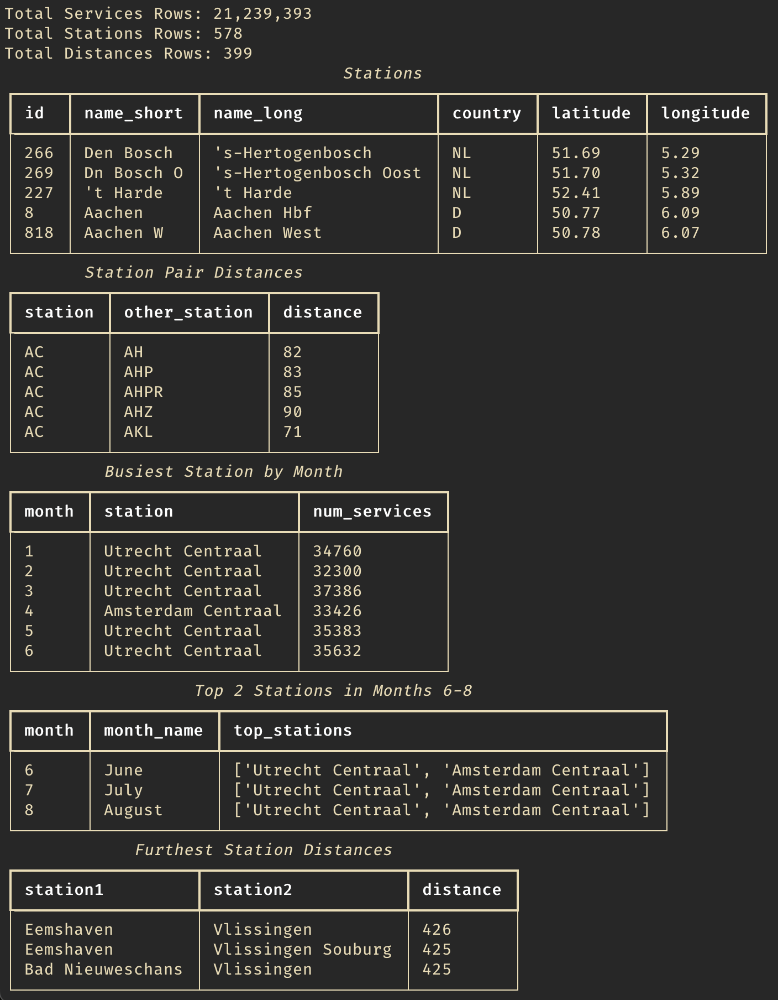

# DuckDB NL Rail Analysis

Follows the [blogpost](https://duckdb.org/2024/05/31/analyzing-railway-traffic-in-the-netherlands.html) from DuckDB on
analyzing railway data from the Netherlands using DuckDB.

Reimplemented the CLI approach in Python using the programmatic API.

